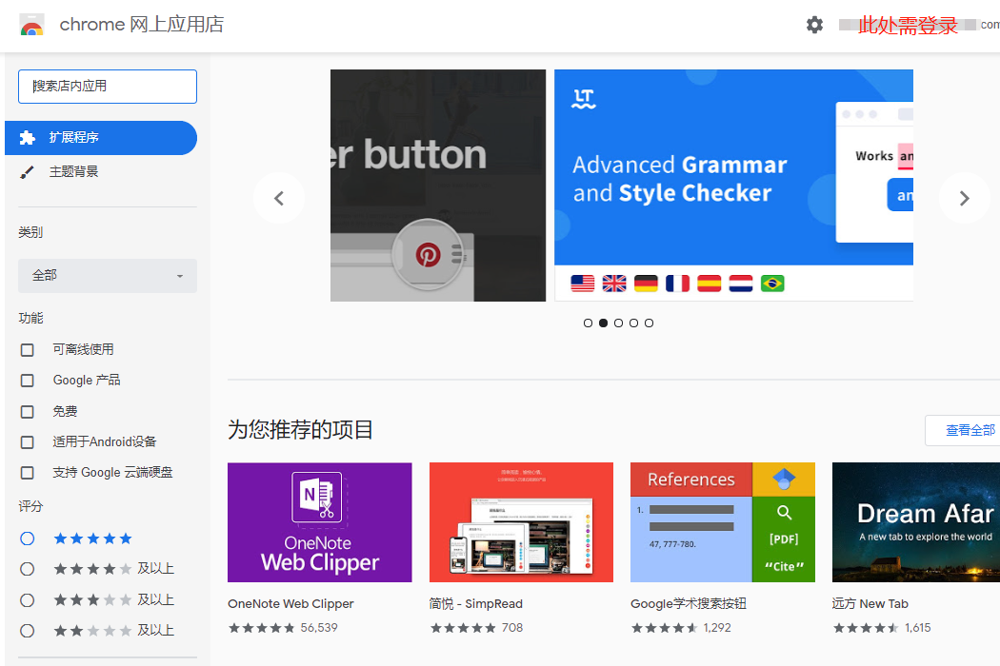
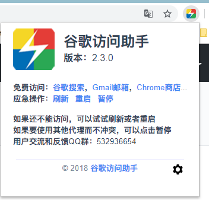
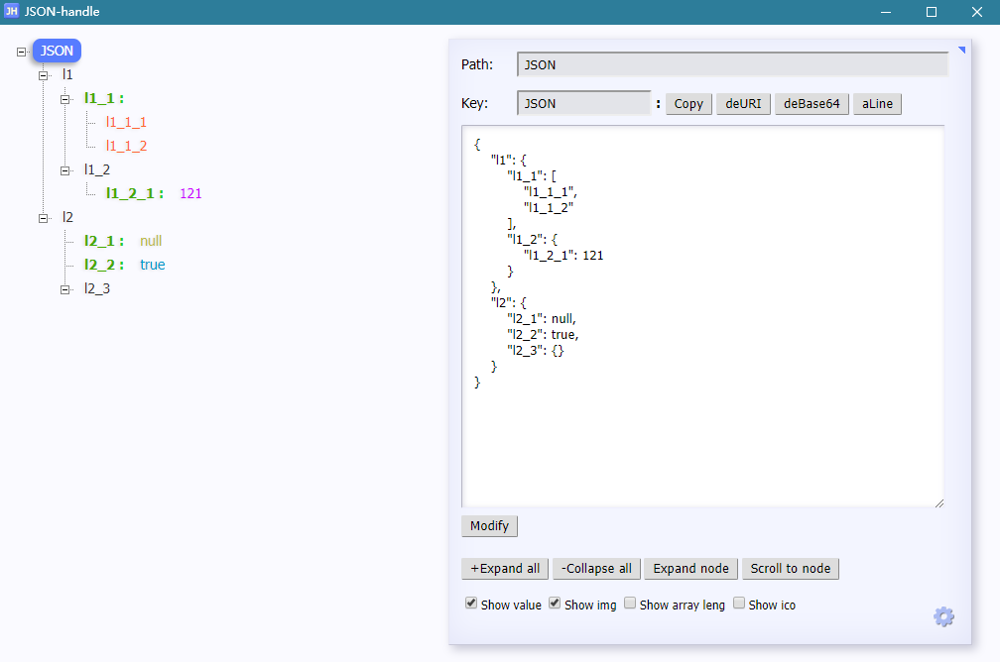
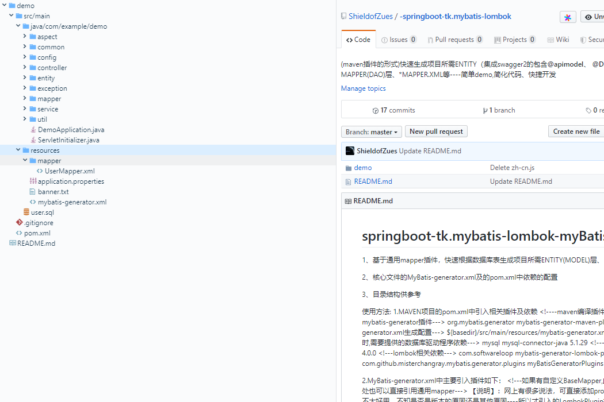
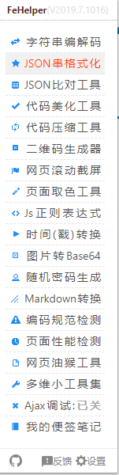
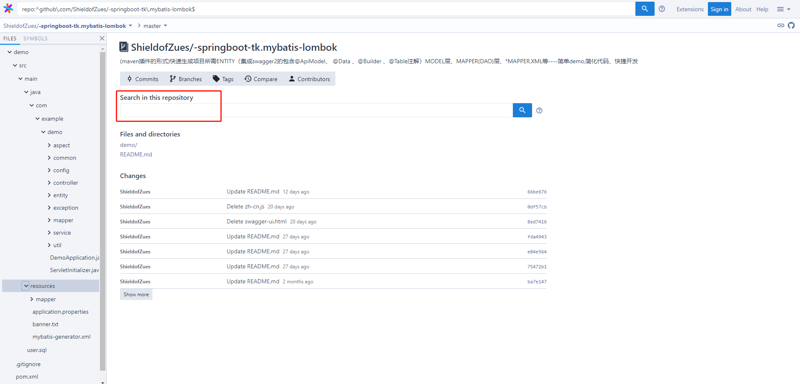

# -Google-Chrome-plugin-sharing
日常高频使用的浏览器插件分享
# （一）日常开发浏览器用到的一些插件分享
---
[TOC]
_写在最前面：安装“谷歌浏览器”以下插件的前提-先墙，推荐蓝灯 链接如：[lantern](
https://github.com/getlantern/lantern) 使用方法很简单，点击启动即可。_
各个浏览器都有很多好用的插件，个人比较依赖谷歌~大家依自己喜好，用得上的就是好插件[捂嘴笑]~~

## 一、谷歌浏览器插件
__谷歌浏览器>更多工具>扩展程序>（访问需墙）打开Chorm网上应用店__

大部分在GitHub上均有托管，感兴趣可以去找找看，没准儿有不一样的灵感~
### 1.1 谷歌访问助手/PP谷歌访问助手
谷歌访问助手效果图为例：

*(建议先安装，之后可以借助其翻墙，类似插件还要好多~需要你自己去发现~~)*

最简单易用的谷歌访问助手,为chrome扩展用户量身打造。可以解决chrome扩展无法自动更新的问题，同时可以访问谷歌google搜索，gmail邮箱；
帮助访问Google网站，永久免费，不限时。简单，好用。可更快的访问Google搜索，Gmail邮箱，Google翻译，Google地图，Google Docs文档等。
### 1.2 JSON-handle
效果图：

对JSON格式的内容进行浏览和编辑，以树形图样式展现JSON文档，并可实时编辑。
### 1.4 Axure RP Extension for Chrome

Axure RP Extension for Chrome是一款谷歌插件，用来查看原型文件。
### 1.5 Octotree
效果图：

浏览器扩展（Chrome，Firefox，Opera和Safari）在GitHub和GitLab上显示代码树。 非常棒的探索项目源而无需将每个存储库都拉到您的机器上。 特征：

易于导航的代码树，就像在IDE中一样
使用pjax和Turbolinks快速浏览
支持私有存储库（请参阅说明）
支持GitHub和GitLab Enterprise（仅限Chrome和Opera，请参阅说明）
### 1.6 WEB前端助手(FeHelper)
效果图：

FE助手：包括字符串编解码、代码压缩、美化、JSON格式化、正则表达式、时间转换工具、二维码生成与解码、编码规范检测、页面性能检测、页面取色、Ajax接口调试
### 1.7 Sourcegraph
效果图：

Sourcegraph 被大众广为熟知正是因为它支持在 GitHub 上轻松浏览和搜索代码，Sourcegraph 这款 Chrome 插件称得上是开发者必备的插件，它可以让我们像使用 IDE 一样浏览和搜索 GitHub 代码。Sourcegraph 是一款能够根据语义来把 Web 上的开源代码编入索引的代码搜索浏览工具。你可以从代码仓库和安装包，甚至是函数里搜索代码，同时也可以直接点击被完全创建了链接的代码来阅读文档、跳转到变量定义或者马上找到可用的 Demo。总而言之，你可以在你的 Web 浏览器上完成这一切，而不需要配置任何编辑器。由 Sourcegraph 出品的这款 Chrome 插件，可以非常方便地浏览和搜索 GitHub 上的代码，持跨仓库(repository)搜索、跳转到定义、查找引用等功能，宛若一个功能强大的 IDE。核心功能如跳转到定义(Go-to-definition) —— 浏览文件或查看 pull 请求时，将鼠标悬停在代码上可以查看文档提示，单击即可跳转到定义、查找引用或全文搜索。
### 1.8 其它插件
作为后端开发，常用的接口测试插件Postman本想单独列一下，后来想想还是算了吧！什么年代了~ 现在swagger2接口模式这么主流，再整合诸如[Yapi](https://github.com/YMFE/yapi)之类的可视化接口管理平台，根本没postman什么事了吧[捂脸苦笑]~
 
 还有其它各种插件，这里不再一一赘述，Google在手！天下我有！
 

